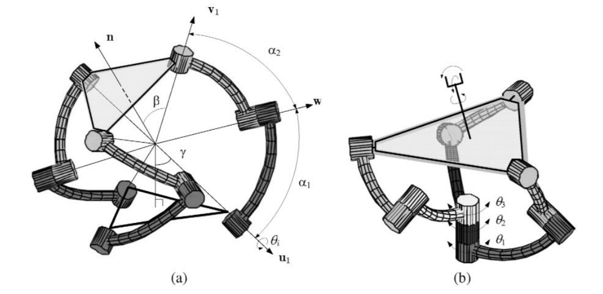
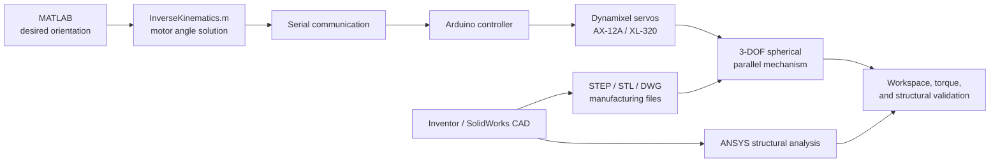

# Design and Implementation of a 3-DOF Parallel Robot

An end-to-end mechatronics project for the design, analysis, fabrication, electronics, and control of a three-degree-of-freedom spherical parallel mechanism. The repository includes CAD design iterations, final manufacturing files, PCB/Gerber assets, Arduino firmware, MATLAB inverse kinematics, torque-transmission analysis, ANSYS structural-analysis files, reports, posters, and presentation material.

<p align="center">
  
  
  
</p>

## Problem

Wrist-like robotic motion requires compact orientation control with multiple rotational degrees of freedom. This project explores a 3-DOF spherical parallel mechanism as a compact wrist joint, combining mechanical design, actuator integration, inverse kinematics, electronics, and structural validation.

## My Role

The work covers the complete development path:

- Mechanism research and architecture selection
- CAD design iterations and final manufacturing files
- Inverse-kinematics and torque-transmission modeling in MATLAB
- Servo control firmware and MATLAB-to-Arduino communication
- PCB design assets and component integration
- Structural-analysis project files and final engineering documentation

## System Architecture



## Project Snapshot

- Domain: robotics, mechatronics, parallel mechanisms, embedded control
- Mechanism: 3-DOF spherical parallel mechanism / wrist-style robot
- Mechanical design: Inventor, SolidWorks, STEP, STL, drawings, exploded views
- Electronics: EasyEDA/CadStar PCB files and Gerber package
- Firmware: Arduino sketches for Dynamixel AX-12A and XL-320 servo control
- Modeling: MATLAB inverse kinematics, torque transmission, workspace and mechanism analysis
- Analysis: ANSYS structural analysis project files and solved result artifacts
- Documentation: final report, poster, presentation, images, and reference material

## Engineering Scope

- Concept research into spherical parallel mechanisms and prosthetic/robotic wrist applications.
- Multiple design branches, including coaxial, direct-connection, XL-320, AX-12A, and final designs.
- Final CAD assets in Inventor, SolidWorks, STEP, STL, and DWG formats.
- Structural analysis files for validating critical components under load.
- PCB design files, Gerber exports, and electronics backups.
- Arduino firmware for servo configuration, movement, reset, ID changes, and MATLAB-to-Arduino communication.
- MATLAB applications and scripts for inverse kinematics, serial communication, torque transmission, and mechanism analysis.

## Repository Map

```text
Design/
  Coaxial/                         Early coaxial mechanism designs
  DirectConnection/                Direct actuator connection concepts
  Final/                           Final CAD, drawings, STEP, STL, SolidWorks, Inventor
  Final AX12A/                     AX-12A-based final design variant
Circuit/
  EasyEDA/, CadStar/               PCB projects, backups, and Gerber package
Programming/
  InverseKinematics.m              Motor-angle solution for desired wrist orientation
  TorqueTransmission.m             Jacobian-based torque transmission analysis
  MechanismTorqueAnalysis.m        Torque plots across motion ranges
  Arduino/                         Servo control and MATLAB communication firmware
Structural Analysis/
  Structural Analysis.wbpj         ANSYS Workbench project and result files
Functional Analysis/
  SPM Functional Analysis.*        Functional mechanism analysis artifacts
Report/
  Final Report.pdf, Poster.pdf,
  Presentation.pptx, images        Final documentation and presentation deliverables
Files/
  datasheets and mechanism papers  Actuator, component, and research references
```

## Kinematics and Control

`Programming/InverseKinematics.m` computes motor commands from a desired 3-axis orientation. The script builds rotation matrices for X, Y, and Z inputs, solves the spherical parallel mechanism geometry, converts mechanism angles into motor angles, and applies calibration offsets.

The control path includes:

- MATLAB serial communication scripts
- A MATLAB app for inverse-kinematics testing
- Arduino firmware that receives comma-separated commands over serial
- Dynamixel XL-320 and AX-12A servo control sketches
- Servo ID, reset, and movement utilities

This connects mathematical kinematics to real actuator commands.

## Torque and Structural Analysis

`Programming/TorqueTransmission.m` computes Jacobian-based torque transmission through the mechanism. `Programming/MechanismTorqueAnalysis.m` evaluates how transmitted torque changes across angular sweeps from -30 to 30 degrees.

The repository also includes ANSYS Workbench files and solved structural-analysis data, supporting the mechanical design with stress/displacement validation rather than relying only on CAD geometry.

## Final Deliverables

- Working kinematic model for a 3-DOF spherical parallel mechanism
- Multiple CAD iterations and a final manufacturing-oriented design
- SolidWorks, Inventor, STEP, STL, and DWG assets
- Arduino firmware for actuator control and MATLAB communication
- PCB/Gerber design assets
- Structural-analysis project files and result artifacts
- Final report, poster, presentation, and mechanism images

## How to Explore

- Start with `Report/Final Report.pdf` and `Report/Poster.pdf` for project context.
- Review `Report/Images/` for mechanism architecture, workspace, and final visual material.
- Use `Design/Final/` for the final mechanical design package.
- Use `Programming/InverseKinematics.m` and `Programming/TorqueTransmission.m` for the core mathematical model.
- Use `Programming/Arduino/` for the embedded actuator-control layer.
